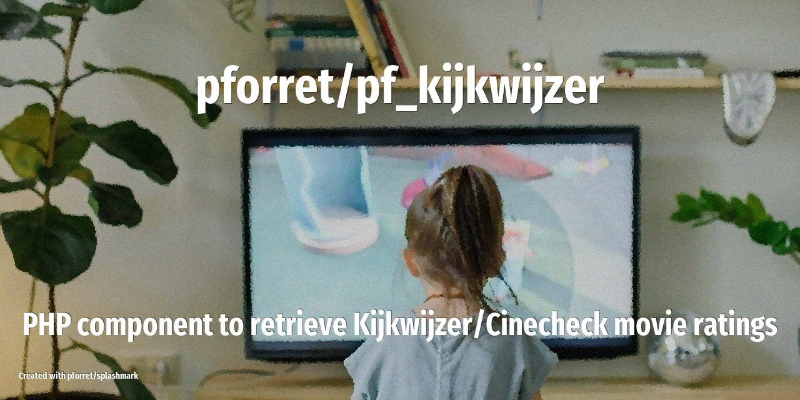

# PHP Component to retrieve Kijkwijzer/Cinecheck ratings for movies

Github: 


Packagist: 
[](https://packagist.org/packages/pforret/pf_kijkwijzer)
[](https://packagist.org/packages/pforret/pf_kijkwijzer)



## Installation

You can install the package via composer:

```bash
composer require pforret/pf_kijkwijzer
```

## Usage

``` php
$obj = new Pforret\PfKijkwijzer();
$movies = $obj->search('Top Gun!');
$movie = $obj->first('Avatar', 2009, 5, PfKijkwijzer::FILTER_MOVIES);
```

## Testing

``` bash
composer test
```

## Changelog

Please see [CHANGELOG](CHANGELOG.md) for more information on what has changed recently.

## Contributing

Please see [CONTRIBUTING](CONTRIBUTING.md) for details.

## Security

If you discover any security related issues, please email author_email instead of using the issue tracker.

## Credits

- [pforret](https://github.com/pforret)
- [All Contributors](../../contributors)

## License

The MIT License (MIT). Please see [License File](LICENSE.md) for more information.
